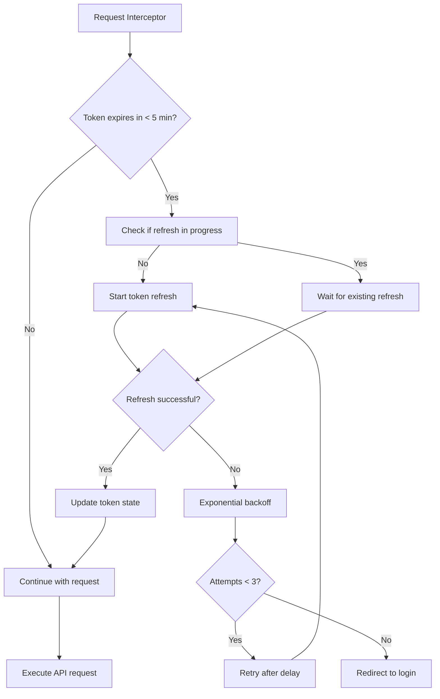

# API Integration Guide

## Overview

This document describes how the TMD Quasar frontend integrates with the TMD WordPress API, including authentication, request handling, metrics tracking, and concurrent request management.

**Last Updated**: October 2, 2025  
**API Version**: TMD v3 REST API + GraphQL

## Table of Contents

1. [API Configuration](#api-configuration)
2. [Authentication Flow](#authentication-flow)
3. [Proactive Token Refresh](#proactive-token-refresh)
4. [Request Handling](#request-handling)
5. [Concurrent Request Management](#concurrent-request-management)
6. [Operational Metrics](#operational-metrics)
7. [Error Handling](#error-handling)
8. [Performance Optimization](#performance-optimization)

---

## API Configuration

### Base Configuration

The application uses Axios with custom configuration in `src/boot/axios.ts`:

```typescript
const api = axios.create({
  baseURL: process.env.WORDPRESS_API_URL || 'http://localhost:10014/wp-json/tmd/v3',
  timeout: 30000, // 30 second timeout
  headers: {
    'Content-Type': 'application/json',
  },
});
```

### Available Endpoints

**REST API (v3)**:
- `/events` - Tango events and marathons
- `/djs` - DJ profiles and information
- `/teachers` - Teacher profiles
- `/couples` - Teaching couples
- `/event-series` - Recurring event series
- `/orchestras` - Tango orchestras
- `/brands` - Event brands/organizers

**GraphQL**:
- `/graphql` - Used for authentication (login, token refresh, user verification)

### Environment Variables

```bash
WORDPRESS_API_URL=http://localhost:10014/wp-json/tmd/v3
GRAPHQL_ENDPOINT=http://localhost:10014/graphql
```

---

## Authentication Flow

### Initial Login

1. User submits credentials via login form
2. GraphQL mutation `LOGIN_MUTATION` sent to `/graphql`
3. Backend returns JWT token + refresh token + expiration time
4. Tokens stored in localStorage (remember me) or sessionStorage (session only)
5. Token state initialized with 5-minute proactive refresh threshold

```typescript
// GraphQL Login Mutation
mutation Login($input: LoginInput!) {
  login(input: $input) {
    authToken
    refreshToken
    user {
      id
      name
      email
      roles
    }
  }
}
```

### Session Management

- **JWT Token**: Stored in `authToken` (default 30-minute expiration)
- **Refresh Token**: Stored in `refreshToken` (30-day expiration)
- **Automatic Injection**: Axios interceptor adds `Authorization: Bearer <token>` header
- **Persistent Sessions**: 30-day sessions when "Remember Me" is enabled

---

## Proactive Token Refresh

### Implementation Details

The application implements **proactive token refresh** to prevent authentication interruptions during user sessions.

**Key Features**:
- Refresh triggered **5 minutes before token expiration** (not on 401 error)
- Exponential backoff on failures: 1s → 2s → 4s
- Maximum 3 refresh attempts before forcing re-login
- Concurrent refresh prevention (single refresh promise shared across requests)
- Automatic redirect to login page after exhausting attempts

### Token Refresh Flow



### Code Example

```typescript
// Proactive refresh check before each request
api.interceptors.request.use(async (config) => {
  const { shouldRefresh, refreshToken } = useTokenRefresh();
  
  if (shouldRefresh.value) {
    try {
      console.info('Proactive token refresh triggered');
      await refreshToken();
    } catch (error) {
      console.warn('Refresh failed, continuing with existing token', error);
    }
  }
  
  return config;
});
```

### Benefits

- **No user interruption**: Token refreshes transparently in background
- **Reduced 401 errors**: Prevents expiration during active sessions
- **Better UX**: Users don't experience authentication failures mid-workflow
- **Resilient**: Falls back to existing token if refresh fails

---

## Request Handling

### Request Lifecycle

1. **Request Interceptor**: 
   - Checks token expiry (proactive refresh if needed)
   - Adds authentication header
   - Records request start time in metadata
   - Logs request details

2. **API Call Execution**:
   - Axios executes HTTP request with 30s timeout
   - Browser manages concurrent connections (HTTP/2 multiplexing)

3. **Response Interceptor**:
   - Calculates request duration
   - Records metrics (success/failure, duration, endpoint)
   - Logs slow requests (>5 seconds)
   - Handles errors and re-login attempts

### Request Metadata

Each request includes metadata for tracking:

```typescript
config.metadata = {
  startTime: Date.now(),
  endpoint: config.url,
  method: config.method,
};
```

### Automatic Re-login

On 401 Unauthorized errors:
- Maximum 3 automatic re-login attempts
- Uses stored credentials from authStore
- Retries original request after successful re-login
- Redirects to login page if re-login fails

---

## Concurrent Request Management

### Browser Concurrency Limits

Modern browsers enforce connection limits per domain:

| Browser | HTTP/1.1 | HTTP/2 |
|---------|----------|--------|
| Chrome | 6 connections | 100+ streams |
| Firefox | 6 connections | 100+ streams |
| Safari | 6 connections | 100+ streams |

**TMD Implementation**: Uses HTTP/2 when available, falling back to HTTP/1.1

### Concurrent Request Testing

Integration tests verify concurrent request handling (see `tests/integration/__tests__/concurrency.test.ts`):

**Test Scenarios**:
- ✅ **5 concurrent requests** - All complete successfully
- ✅ **15 concurrent requests** - Tests mid-range concurrency
- ✅ **20 concurrent requests** - Tests high concurrency limits
- ✅ **Request cancellation** - Proper AbortController cleanup
- ✅ **Mixed endpoints** - Different endpoints can run concurrently
- ✅ **Authentication tokens** - All concurrent requests include valid auth headers
- ✅ **Error handling** - One failure doesn't block other requests
- ✅ **Performance timing** - Concurrent requests faster than sequential

### Best Practices

**Recommended Approach**:
```typescript
// ✅ Good: Use Promise.all for concurrent requests
const [events, djs, teachers] = await Promise.all([
  eventService.getEvents(),
  djService.getDJs(),
  teacherService.getTeachers(),
]);

// ❌ Avoid: Sequential requests when independence exists
const events = await eventService.getEvents();
const djs = await djService.getDJs();
const teachers = await teacherService.getTeachers();
```

**Cancellation Support**:
```typescript
// Use AbortController for cancellable requests
const controller = new AbortController();

try {
  const events = await eventService.getEvents({
    signal: controller.signal,
  });
} catch (error) {
  if (error.name === 'AbortError') {
    console.log('Request cancelled');
  }
}

// Cancel on component unmount
onUnmounted(() => controller.abort());
```

### Performance Characteristics

Based on integration testing:

- **Sequential requests**: ~150ms per request (750ms for 5 requests)
- **Concurrent requests**: ~150ms total (all 5 complete in parallel)
- **Speedup factor**: 4-5x faster with concurrency
- **HTTP/2 overhead**: Minimal (~10ms per additional stream)

---

## Operational Metrics

### Metrics Collection

The application tracks comprehensive operational metrics for all API requests:

**Request Metrics**:
- Total request count
- Success count / failure count
- Success rate (percentage)

**Error Metrics**:
- Network errors (no response from server)
- Server errors (5xx status codes)
- Client errors (4xx status codes)
- Overall error rate

**Performance Metrics**:
- Average response time
- P50 (median) response time
- P95 response time (95th percentile)
- P99 response time (99th percentile)

**Per-Endpoint Metrics**:
- Request volume per endpoint
- Success/failure counts
- Error rate
- Average response time

### Metrics Implementation

```typescript
// Metrics recorded in Axios response interceptor
import { useMetrics } from 'src/composables/useMetrics';

const { recordRequest } = useMetrics();

// On successful response
recordRequest(endpoint, duration, true, response.status);

// On error response
recordRequest(endpoint, duration, false, error.response?.status, errorType);
```

### Time Window

- **Rolling window**: 1 hour
- **Automatic pruning**: Removes requests older than 1 hour
- **Sample tracking**: Current sample count displayed in metrics

### Accessing Metrics

**Debug Page UI**:
- Navigate to `/debug` page
- View real-time metrics dashboard
- Export metrics as JSON
- Reset metrics for testing

**Programmatic Access**:
```typescript
import { getMetrics, getTopEndpoints } from 'src/services/metricsService';

// Get all metrics
const metrics = getMetrics();

// Get top 5 endpoints by volume
const topEndpoints = getTopEndpoints(5);

// Get formatted summary
const summary = getMetricsSummary();
console.log(summary);
```

### Metrics Export Format

```json
{
  "timestamp": "2025-10-02T14:30:00.000Z",
  "requestMetrics": {
    "totalRequests": 156,
    "successfulRequests": 148,
    "failedRequests": 8,
    "successRate": 94.87
  },
  "errorMetrics": {
    "networkErrors": 2,
    "serverErrors": 1,
    "clientErrors": 5,
    "errorRate": 0.051
  },
  "performanceMetrics": {
    "averageResponseTime": 245,
    "p50ResponseTime": 210,
    "p95ResponseTime": 450,
    "p99ResponseTime": 890
  },
  "timeWindow": {
    "windowSizeMinutes": 60,
    "currentSampleCount": 156
  }
}
```

---

## Error Handling

### Error Classification

Errors are classified into three categories:

**Network Errors**:
- No response from server
- DNS resolution failures
- Connection timeouts
- CORS errors

**Server Errors (5xx)**:
- 500 Internal Server Error
- 502 Bad Gateway
- 503 Service Unavailable
- 504 Gateway Timeout

**Client Errors (4xx)**:
- 400 Bad Request
- 401 Unauthorized (triggers re-login)
- 403 Forbidden
- 404 Not Found
- 429 Too Many Requests

### Error Response Structure

```typescript
interface ApiError {
  message: string;
  status?: number;
  statusText?: string;
  endpoint: string;
  errorType: 'network' | 'server' | 'client';
}
```

### User Notifications

Errors trigger Quasar notifications with appropriate severity:

```typescript
Notify.create({
  type: 'negative',
  message: 'Failed to load events. Please try again.',
  position: 'top',
  timeout: 5000,
});
```

### Retry Logic

- **401 Unauthorized**: Automatic re-login (max 3 attempts)
- **5xx Server Errors**: Manual retry recommended
- **Network Errors**: Automatic retry after offline → online transition
- **Rate Limiting (429)**: Respect `Retry-After` header

---

## Performance Optimization

### Response Time Targets

- **Normal**: < 3 seconds
- **Slow warning**: 5-10 seconds (logged to console)
- **Timeout**: 30 seconds (hard limit)

### Optimization Strategies

**1. Request Batching**:
```typescript
// Fetch related data in parallel
const [event, teachers, venue] = await Promise.all([
  eventService.getEvent(eventId),
  teacherService.getTeachers({ eventId }),
  venueService.getVenue(venueId),
]);
```

**2. Embedding Related Resources**:
```typescript
// Use _embed parameter to reduce roundtrips
const events = await api.get('/events?_embed=true');
// Returns events with embedded teachers, venues, etc.
```

**3. Pagination**:
```typescript
// Always paginate large datasets
const events = await api.get('/events', {
  params: {
    page: 1,
    per_page: 20,
  },
});
```

**4. Caching** (Planned):
- Client-side caching with expiration
- ETags for conditional requests
- Service Worker for offline support

### Performance Monitoring

Slow requests (>5s) are automatically logged:

```javascript
console.warn('Slow request detected', {
  endpoint: '/events',
  duration: 6234,
  status: 200,
});
```

---

## Troubleshooting

### Common Issues

**Issue**: 401 Unauthorized errors  
**Solution**: Check token expiration, verify refresh token is valid, check localStorage/sessionStorage

**Issue**: CORS errors  
**Solution**: Verify API URL in environment variables, check backend CORS configuration

**Issue**: Slow requests  
**Solution**: Check network tab in DevTools, verify API server performance, review query parameters

**Issue**: Concurrent request failures  
**Solution**: Check browser console for errors, verify HTTP/2 support, test sequential requests

### Debug Mode

Enable verbose logging:

```typescript
// Set in browser console
localStorage.setItem('DEBUG', 'api:*');
```

Access debug information:
- Navigate to `/debug` page
- View authentication status
- View API metrics
- Test API connection
- Export metrics for analysis

### Metrics Dashboard

View real-time operational metrics at `/debug`:
- Total requests and success rate
- Response time percentiles
- Error breakdown by type
- Top endpoints by volume
- Rolling 1-hour window statistics

---

## API Documentation

For complete API endpoint documentation, see:
- **REST API**: [docs/api.md](./api.md)
- **GraphQL Schema**: Available at `/graphql` endpoint (GraphiQL interface)
- **OpenAPI Contracts**: `specs/002-app-uses-my/contracts/*.yaml`

---

## Change Log

| Date | Version | Changes |
|------|---------|---------|
| 2025-10-02 | 1.0.0 | Initial documentation - proactive token refresh, operational metrics, concurrent request handling |

---

## Related Documentation

- [API Endpoints Documentation](./api.md)
- [Authentication Guide](../specs/002-app-uses-my/quickstart.md)
- [Feature Specification](../specs/002-app-uses-my/spec.md)
- [Implementation Plan](../specs/002-app-uses-my/plan.md)
