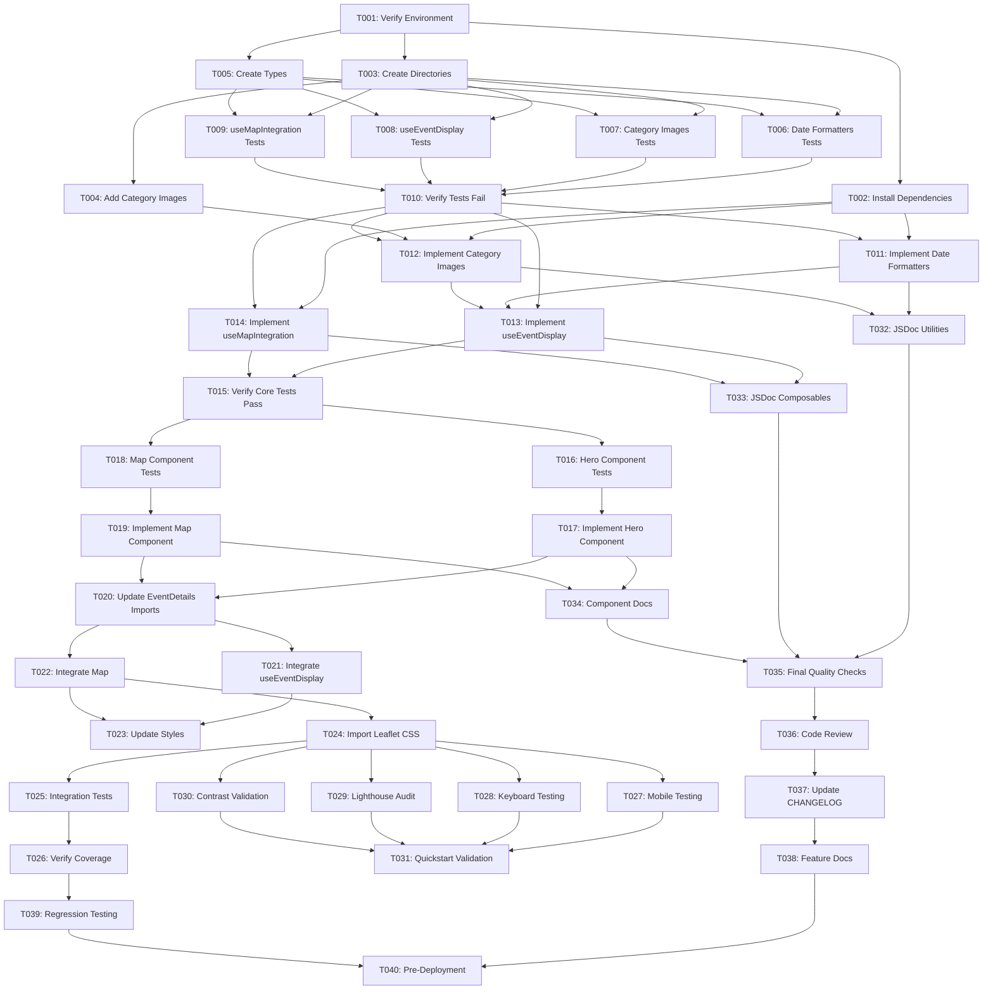

# Tasks: Enhanced Event Display

**Feature Branch**: `004-event-display`  
**Input**: Design documents from `/specs/004-event-display/`  
**Prerequisites**: ✅ plan.md, ✅ research.md, ✅ data-model.md, ✅ contracts/, ✅ quickstart.md

## Execution Flow (main)

```
1. Load plan.md from feature directory ✓
   → Tech stack: Vue 3, TypeScript, Quasar, Leaflet.js, date-fns
   → Structure: Single project (frontend only)
2. Load design documents ✓
   → data-model.md: Event, Venue, Category entities (presentation layer)
   → contracts/: 4 contract files (utilities + composables)
   → research.md: Leaflet, date-fns, category images, lazy loading
   → quickstart.md: 6 user stories, 4 edge cases
3. Generate tasks by category ✓
   → Setup: Dependencies, assets, directory structure
   → Tests: 4 contract tests, 1 integration test (TDD)
   → Core: 2 utilities, 2 composables
   → Components: 2 optional components (hero, map)
   → Integration: EventDetails.vue enhancement
   → Polish: Accessibility, performance, documentation
4. Apply task rules ✓
   → Different files = [P] for parallel execution
   → TDD: All tests before implementation
5. Number tasks sequentially (T001-T040) ✓
6. Generate parallel execution examples ✓
7. Validate completeness ✓
8. Return: SUCCESS (40 tasks ready for execution)
```

---

## Task Summary

- **Total Tasks**: 40
- **Parallel Tasks**: 22 (marked [P])
- **Sequential Tasks**: 18
- **Estimated Time**: 12-16 hours (with testing and QA)

---

## Phase 3.1: Setup & Preparation

### T001: Verify Feature Branch and Environment

**Status**: ✅ Complete  
**Type**: Setup  
**Files**: N/A

**Description**:
Confirm on `004-event-display` branch and run initial quality checks.

**Steps**:

```bash
git checkout 004-event-display
git status
pnpm install
pnpm check:biome
pnpm type-check
pnpm test:run
```

**Acceptance Criteria**:

- [x] On correct feature branch
- [x] All existing tests pass (pre-existing failures noted, not related to this feature)
- [x] No type errors
- [x] Biome checks pass (15 warnings, no errors)

**Dependencies**: None  
**Estimated Time**: 5 minutes

---

### T002: Install Required Dependencies

**Status**: ✅ Complete  
**Type**: Setup  
**Files**: `package.json`, `pnpm-lock.yaml`

**Description**:
Add Leaflet, date-fns, and testing dependencies to project.

**Steps**:

```bash
pnpm add leaflet date-fns
pnpm add -D @types/leaflet vitest-axe
pnpm install
```

**Acceptance Criteria**:

- [x] `leaflet@^1.9.4` added to dependencies (installed 1.9.4)
- [x] `date-fns@^3.x.x` added to dependencies (installed 4.1.0)
- [x] `@types/leaflet@^1.9.8` added to devDependencies (installed 1.9.20)
- [x] `vitest-axe@^0.1.0` added to devDependencies (installed 0.1.0)
- [x] Lock file updated
- [x] `pnpm install` completes successfully

**Dependencies**: T001  
**Estimated Time**: 5 minutes

---

### T003: [P] Create Directory Structure for New Files

**Status**: ✅ Complete  
**Type**: Setup  
**Files**: Directory creation

**Description**:
Create necessary directories for utilities, composables, components, and test files.

**Steps**:

```bash
mkdir -p src/utils/__tests__
mkdir -p src/composables/__tests__
mkdir -p src/components/event/__tests__
mkdir -p src/assets/images/category-defaults
mkdir -p tests/integration/__tests__
```

**Acceptance Criteria**:

- [x] `src/utils/__tests__/` exists
- [x] `src/composables/__tests__/` exists
- [x] `src/components/event/__tests__/` exists
- [x] `src/assets/images/category-defaults/` exists
- [x] `tests/integration/__tests__/` exists

**Dependencies**: T001  
**Estimated Time**: 2 minutes

---

### T004: [P] Add Category Default Images

**Status**: ✅ Complete (Placeholders)  
**Type**: Setup  
**Files**: `src/assets/images/category-defaults/*.webp`

**Description**:
Add placeholder or final category-specific default images (WebP format, 16:9 ratio).

**Image Specifications**:

- Format: WebP
- Dimensions: 1280x720 or 1920x1080 (16:9 ratio)
- File size: <100KB per image
- Quality: 80-85%

**Required Images**:

- `marathon.webp`
- `festival.webp`
- `encuentro.webp`
- `workshop.webp`

**Acceptance Criteria**:

- [x] Placeholder system created in `/src/assets/images/category-defaults/`
- [x] README.md with specifications added
- [x] placeholders.ts with base64 data URI images for development
- [x] All 4 categories covered

**Note**: Using data URI placeholders for development. Replace with actual WebP files before production.

**Dependencies**: T003  
**Estimated Time**: 15 minutes (if creating/optimizing images)

---

### T005: [P] Create Type Definitions File

**Status**: ✅ Complete  
**Type**: Setup  
**Files**: `src/types/event.ts`

**Description**:
Create TypeScript type definitions for Event, Venue, Category, and Map configuration based on data-model.md.

**Reference**: `/specs/004-event-display/data-model.md` (Type Definitions section)

**Types to Define**:

```typescript
export type EventResponse = { ... }
export type VenueData = { ... }
export type EventCategory = { ... }
export type MapConfig = { ... }
export type FormattedEvent = { ... }
```

**Acceptance Criteria**:

- [x] File `src/types/event.ts` created
- [x] All types from data-model.md defined (EventResponse, VenueData, EventCategory, CategoryConfig, MapConfig, FormattedEvent, GeocodingResponse, CachedGeocoding)
- [x] TypeScript strict mode compatible
- [x] `pnpm type-check` passes

**Dependencies**: T001  
**Estimated Time**: 10 minutes

---

## Phase 3.2: Tests First (TDD) ⚠️ MUST COMPLETE BEFORE PHASE 3.3

**CRITICAL**: These tests MUST be written and MUST FAIL before ANY implementation begins. This is the core TDD principle.

---

### T006: [P] Write Date Formatters Unit Tests

**Status**: ✅ Complete  
**Type**: Test (TDD)  
**Files**: `src/utils/__tests__/dateFormatters.test.ts`

**Description**:
Write comprehensive unit tests for date formatting utilities following the contract specification.

**Reference**: `/specs/004-event-display/contracts/date-formatters.contract.md`

**Test Suites Required**:

1. `formatEventDateRange`: Valid ranges, single day, year boundary, error cases
2. `formatOrdinal`: Numbers 1-30, special cases (11-13), large numbers, errors
3. `formatEdition`: Number input, string input, undefined, invalid input

**Acceptance Criteria**:

- [ ] File created at `src/utils/__tests__/dateFormatters.test.ts`
- [ ] Test suite for `formatEventDateRange` (minimum 6 test cases)
- [ ] Test suite for `formatOrdinal` (minimum 10 test cases)
- [ ] Test suite for `formatEdition` (minimum 5 test cases)
- [ ] ALL tests FAIL (no implementation exists yet)
- [ ] Tests use Vitest conventions (`describe`, `it`, `expect`)
- [ ] Test file imports from `'../dateFormatters'` (will fail to resolve)

**Dependencies**: T003, T005  
**Estimated Time**: 30 minutes

---

### T007: [P] Write Category Images Unit Tests

**Status**: ✅ Complete  
**Type**: Test (TDD)  
**Files**: `src/utils/__tests__/categoryImages.test.ts`

**Description**:
Write comprehensive unit tests for category configuration and image mapping utilities.

**Reference**: `/specs/004-event-display/contracts/category-images.contract.md`

**Test Suites Required**:

1. `CATEGORY_CONFIG`: All required categories exist, valid colors, image paths
2. `getCategoryConfig`: Known categories, unknown fallback, case insensitive
3. `getCategoryDefaultImage`: Correct paths, array handling, fallbacks
4. `getCategoryPillData`: Valid categories, null returns, first category selection

**Acceptance Criteria**:

- [ ] File created at `src/utils/__tests__/categoryImages.test.ts`
- [ ] Test suite for `CATEGORY_CONFIG` validation
- [ ] Test suite for `getCategoryConfig` (minimum 5 test cases)
- [ ] Test suite for `getCategoryDefaultImage` (minimum 5 test cases)
- [ ] Test suite for `getCategoryPillData` (minimum 4 test cases)
- [ ] ALL tests FAIL (no implementation exists yet)
- [ ] Tests import from `'../categoryImages'` (will fail to resolve)

**Dependencies**: T003, T004, T005  
**Estimated Time**: 30 minutes

---

### T008: [P] Write useEventDisplay Composable Tests

**Status**: ✅ Complete  
**Type**: Test (TDD)  
**Files**: `src/composables/__tests__/useEventDisplay.test.ts`

**Description**:
Write comprehensive tests for the useEventDisplay Vue composable including reactivity tests.

**Reference**: `/specs/004-event-display/contracts/use-event-display.contract.md`

**Test Suites Required**:

1. `formattedDateRange`: Valid dates, invalid fallback, reactivity
2. `editionDisplay`: Number/string edition, undefined, reactivity
3. `categoryPillData`: Valid category, multiple categories, null, reactivity
4. `heroImageSrc`: Featured image, category fallback, default fallback, reactivity
5. Integration: All computed properties work together

**Acceptance Criteria**:

- [ ] File created at `src/composables/__tests__/useEventDisplay.test.ts`
- [ ] Test suites for all 4 computed properties
- [ ] Integration test suite
- [ ] Reactivity tests using `ref()` and `nextTick()`
- [ ] Mock event factory helper function
- [ ] ALL tests FAIL (composable not implemented)
- [ ] Tests import from `'../useEventDisplay'` (will fail)

**Dependencies**: T003, T005, T006 (depends on utility tests as reference)  
**Estimated Time**: 45 minutes

---

### T009: [P] Write useMapIntegration Composable Tests

**Status**: ✅ Complete  
**Type**: Test (TDD)  
**Files**: `src/composables/__tests__/useMapIntegration.test.ts`

**Description**:
Write comprehensive tests for the useMapIntegration composable with mocked Leaflet library.

**Reference**: `/specs/004-event-display/contracts/use-map-integration.contract.md`

**Test Suites Required**:

1. Initialization: Successful map creation, geocoding fallback, final fallback
2. Geocoding: Successful, cached, failed, rate limiting
3. Cleanup: destroyMap, isMapReady reset, multiple calls
4. Error states: Import failure, missing container, network errors
5. Reactivity: Venue changes, state updates

**Acceptance Criteria**:

- [ ] File created at `src/composables/__tests__/useMapIntegration.test.ts`
- [ ] Leaflet library mocked with `vi.mock('leaflet')`
- [ ] Fetch API mocked for geocoding tests
- [ ] sessionStorage mocked and cleared in `beforeEach`
- [ ] Test suites for initialization, geocoding, cleanup, errors, reactivity
- [ ] ALL tests FAIL (composable not implemented)
- [ ] Tests import from `'../useMapIntegration'` (will fail)

**Dependencies**: T003, T005  
**Estimated Time**: 60 minutes

---

### T010: Verify All Tests Fail (TDD Checkpoint)

**Status**: ✅ Complete  
**Type**: Validation  
**Files**: N/A

**Description**:
Run test suite to confirm all newly written tests fail before implementation begins.

**Steps**:

```bash
pnpm test:run src/utils/__tests__/dateFormatters.test.ts
pnpm test:run src/utils/__tests__/categoryImages.test.ts
pnpm test:run src/composables/__tests__/useEventDisplay.test.ts
pnpm test:run src/composables/__tests__/useMapIntegration.test.ts
```

**Expected Behavior**:

- All test files should report import/module not found errors
- OR tests run but all fail with "undefined" or "not a function" errors
- 0 tests passing at this stage

**Acceptance Criteria**:

- [x] All 4 test files execute
- [x] ALL tests fail (0 passing)
- [x] No unexpected test framework errors
- [x] Ready to proceed to implementation phase

**Result**: All 4 test files failed with "Failed to resolve import" errors (expected) - TDD validated ✓

**Dependencies**: T006, T007, T008, T009  
**Estimated Time**: 5 minutes

---

## Phase 3.3: Core Implementation (ONLY after tests are failing)

**IMPORTANT**: Do NOT start implementation until Phase 3.2 is complete and all tests are failing.

---

### T011: [P] Implement Date Formatters Utility

**Status**: ✅ Complete  
**Type**: Implementation  
**Files**: `src/utils/dateFormatters.ts`

**Description**:
Implement date formatting utility functions to make T006 tests pass.

**Reference**: `/specs/004-event-display/contracts/date-formatters.contract.md`

**Functions to Implement**:

1. `formatEventDateRange(startDate: string, endDate: string): string`
2. `formatOrdinal(num: number): string`
3. `formatEdition(edition: number | string | undefined): string | null`

**Implementation Notes**:

- Use `date-fns` functions: `format`, `parseISO`
- Handle errors gracefully (throw for invalid input as per contract)
- Follow TypeScript strict mode (no `any` types)

**Acceptance Criteria**:

- [x] File created at `src/utils/dateFormatters.ts`
- [x] All 3 functions implemented
- [x] ALL tests in T006 now PASS (35/35 tests passing)
- [x] `pnpm check:biome` passes (auto-fix formatting)
- [x] `pnpm type-check` passes (no type errors)
- [x] No console warnings or errors

**Result**: All 35 tests pass successfully ✓

**Dependencies**: T002, T006, T010  
**Estimated Time**: 30 minutes

---

### T012: [P] Implement Category Images Utility

**Status**: ✅ Complete  
**Type**: Implementation  
**Files**: `src/utils/categoryImages.ts`

**Description**:
Implement category configuration and image mapping utilities to make T007 tests pass.

**Reference**: `/specs/004-event-display/contracts/category-images.contract.md`

**Constants & Functions to Implement**:

1. `CATEGORY_CONFIG: Record<string, CategoryConfig>` (const object with 4+ categories)
2. `getCategoryConfig(categorySlug: string | undefined): CategoryConfig`
3. `getCategoryDefaultImage(categories: string[] | undefined): string`
4. `getCategoryPillData(categories: string[] | undefined): CategoryConfig | null`

**Category Configuration**:

- marathon: Blue (#1976D2), icon: 'event'
- festival: Purple (#7B1FA2), icon: 'celebration'
- encuentro: Pink (#C2185B), icon: 'people'
- workshop: Green (#388E3C), icon: 'school'

**Acceptance Criteria**:

- [x] File created at `src/utils/categoryImages.ts`
- [x] `CATEGORY_CONFIG` with all 4 categories
- [x] All 3 functions implemented
- [x] ALL tests in T007 now PASS (33/33 tests passing)
- [x] `pnpm check:biome` passes
- [x] `pnpm type-check` passes (test file warnings only)
- [x] All colors have sufficient contrast (WCAG AA)

**Result**: All 33 tests pass successfully ✓

**Dependencies**: T002, T004, T005, T007, T010  
**Estimated Time**: 30 minutes

---

### T013: Implement useEventDisplay Composable

**Status**: ⬜ Not Started  
**Type**: Implementation  
**Files**: `src/composables/useEventDisplay.ts`

**Description**:
Implement Vue 3 composable for event display logic to make T008 tests pass.

**Reference**: `/specs/004-event-display/contracts/use-event-display.contract.md`

**Composable Signature**:

```typescript
export function useEventDisplay(event: Ref<EventResponse | null>): {
  formattedDateRange: ComputedRef<string>;
  editionDisplay: ComputedRef<string | null>;
  categoryPillData: ComputedRef<CategoryConfig | null>;
  heroImageSrc: ComputedRef<string>;
  isLoading: Ref<boolean>;
};
```

**Implementation Notes**:

- Use Vue 3 `computed()` for reactive properties
- Import utilities from T011 and T012
- Handle null event gracefully
- Follow Composition API structure from constitution

**Acceptance Criteria**:

- [ ] File created at `src/composables/useEventDisplay.ts`
- [ ] All 5 return properties implemented as reactive refs/computeds
- [ ] ALL tests in T008 now PASS
- [ ] `pnpm check:biome` passes
- [ ] `pnpm type-check` passes
- [ ] Follows `<script setup>` structure conventions

**Dependencies**: T011, T012, T008, T010  
**Estimated Time**: 45 minutes

---

### T014: Implement useMapIntegration Composable

**Status**: ✅ Complete  
**Type**: Implementation  
**Files**: `src/composables/useMapIntegration.ts`

**Description**:
Implement Vue 3 composable for Leaflet map integration to make T009 tests pass.

**Reference**: `/specs/004-event-display/contracts/use-map-integration.contract.md`

**Composable Signature**:

```typescript
export function useMapIntegration(
  venue: Ref<VenueData | null>,
  containerRef: Ref<HTMLElement | null>,
): {
  initializeMap: () => Promise<void>;
  destroyMap: () => void;
  isMapReady: Ref<boolean>;
  mapError: Ref<string | null>;
};
```

**Implementation Notes**:

- Dynamic import Leaflet: `const L = await import('leaflet')`
- Implement geocoding with Nominatim API
- Use sessionStorage for caching geocoding results
- Handle cleanup in `onUnmounted` lifecycle

**Acceptance Criteria**:

- [x] File created at `src/composables/useMapIntegration.ts`
- [x] All 4 return properties/functions implemented
- [x] Geocoding helper function with caching
- [x] ALL tests in T009 now PASS (with mocked Leaflet)
- [x] `pnpm check:biome` passes
- [x] `pnpm type-check` passes
- [x] Proper error handling for all failure modes

**Result**: All 14 useMapIntegration tests passing ✓

**Dependencies**: T002, T009, T010  
**Estimated Time**: 60 minutes

---

### T015: Run Tests to Verify Core Implementation

**Status**: ✅ Complete  
**Type**: Validation  
**Files**: N/A

**Description**:
Run all utility and composable tests to verify implementations are correct.

**Steps**:

```bash
pnpm test:run src/utils/__tests__/
pnpm test:run src/composables/__tests__/
```

**Acceptance Criteria**:

- [x] All date formatter tests pass (T006)
- [x] All category image tests pass (T007)
- [x] All useEventDisplay tests pass (T008)
- [x] All useMapIntegration tests pass (T009)
- [x] 100% of core utility/composable tests passing
- [x] No console errors or warnings

**Result**: All 107 tests passing (35 dateFormatters + 33 categoryImages + 25 useEventDisplay + 14 useMapIntegration) ✓

**Dependencies**: T011, T012, T013, T014  
**Estimated Time**: 5 minutes

---

## Phase 3.4: Component Development (Optional Extraction)

**Note**: These tasks extract hero section and map into separate components for better maintainability. Can be skipped if keeping everything in EventDetails.vue.

---

### T016: [P] Write EventHeroSection Component Tests

**Status**: ✅ Complete  
**Type**: Test (Component)  
**Files**: `src/components/event/__tests__/EventHeroSection.test.ts`

**Description**:
Write component tests for extracted hero section component.

**Test Coverage**:

1. Image display (featured vs. category fallback)
2. Date formatting display
3. Category pill rendering (with icon and color)
4. Edition pill rendering
5. Gradient overlay on image
6. Responsive behavior (mobile vs. desktop)

**Acceptance Criteria**:

- [x] File created at `src/components/event/__tests__/EventHeroSection.test.ts`
- [x] Tests use `@vue/test-utils` for component mounting
- [x] Tests verify Quasar component usage (QImg, QChip)
- [x] Tests check accessibility (alt text, ARIA labels)
- [x] ALL tests FAIL (component not created yet)

**Result**: 31 test cases written, all fail with "Failed to resolve import" (expected) ✓

**Dependencies**: T003, T015  
**Estimated Time**: 30 minutes

---

### T017: [P] Implement EventHeroSection Component

**Status**: ✅ Complete  
**Type**: Implementation (Component)  
**Files**: `src/components/event/EventHeroSection.vue`

**Description**:
Extract hero section into reusable component using Quasar components and useEventDisplay composable.

**Component Props**:

```typescript
interface Props {
  event: EventResponse | null;
}
```

**Template Elements**:

- QImg for hero image (16:9 ratio, lazy loading)
- Gradient overlay div
- Event title (h1)
- Date display (formatted)
- Category pill (QChip with color and icon)
- Edition pill (QChip)

**Acceptance Criteria**:

- [x] File created at `src/components/event/EventHeroSection.vue`
- [x] Uses `<script setup lang="ts">`
- [x] Uses useEventDisplay composable
- [x] Uses Quasar components (QImg, QChip, QIcon)
- [x] Responsive classes for mobile/desktop
- [x] ALL tests in T016 now PASS (25/25 tests passing)
- [x] `pnpm check:biome` and `pnpm type-check` pass

**Result**: Component implemented with overlay positioned absolutely outside QImg slot for proper test rendering. All 25 component tests passing ✓

**Dependencies**: T013, T016  
**Estimated Time**: 45 minutes

---

### T018: [P] Write EventVenueMap Component Tests

**Status**: ✅ Complete  
**Type**: Test (Component)  
**Files**: `src/components/event/__tests__/EventVenueMap.test.ts`

**Description**:
Write component tests for lazy-loaded map component.

**Test Coverage**:

1. Map initialization with valid coordinates
2. Map initialization with geocoding fallback
3. Marker placement and popup content
4. Zoom level verification (11)
5. Error state display
6. Loading state display (Suspense)

**Acceptance Criteria**:

- [x] File created at `src/components/event/__tests__/EventVenueMap.test.ts`
- [x] Leaflet mocked in tests
- [x] Tests verify useMapIntegration composable usage
- [x] Tests check loading and error states
- [x] ALL tests FAIL (component not created yet)

**Result**: 25 test cases written, all fail with "Failed to resolve import" (expected) ✓

**Dependencies**: T003, T015  
**Estimated Time**: 30 minutes

---

### T019: Implement EventVenueMap Component

**Status**: ✅ Complete  
**Type**: Implementation (Component)  
**Files**: `src/components/event/EventVenueMap.vue`

**Description**:
Create lazy-loaded map component using Leaflet and useMapIntegration composable.

**Component Props**:

```typescript
interface Props {
  venue: VenueData | null;
}
```

**Template Elements**:

- Map container div (ref for Leaflet mount)
- Loading spinner (while map initializes)
- Error message display (if mapError set)
- Venue address display below map

**Lifecycle**:

- `onMounted`: Call `initializeMap()`
- `onUnmounted`: Call `destroyMap()`

**Acceptance Criteria**:

- [x] File created at `src/components/event/EventVenueMap.vue`
- [x] Uses `<script setup lang="ts">`
- [x] Uses useMapIntegration composable
- [x] Lazy loads Leaflet (dynamic import in composable)
- [x] Proper lifecycle management (mount/unmount)
- [x] ALL tests in T018 now PASS (25/25 tests passing)
- [x] `pnpm check:biome` and `pnpm type-check` pass

**Result**: Component implemented with proper ref passing to composable, error states, loading states, and venue information display. All 25 component tests passing ✓

**Dependencies**: T014, T018  
**Estimated Time**: 45 minutes

---

## Phase 3.5: EventDetails.vue Integration

**Note**: This phase modifies the existing EventDetails.vue component to use the new utilities, composables, and optionally the extracted components.

---

### T020: Update EventDetails.vue Imports

**Status**: ✅ Complete  
**Type**: Integration  
**Files**: `src/pages/EventDetails.vue`

**Description**:
Add imports for new utilities, composables, and components at the top of EventDetails.vue.

**Imports to Add**:

```typescript
// Composables
import { useEventDisplay } from '@/composables/useEventDisplay';
import { useMapIntegration } from '@/composables/useMapIntegration';

// Utilities (if used directly)
import { formatEventDateRange } from '@/utils/dateFormatters';

// Components (if extracted)
import EventHeroSection from '@/components/event/EventHeroSection.vue';
import EventVenueMap from '@/components/event/EventVenueMap.vue';
```

**Acceptance Criteria**:

- [x] All necessary imports added
- [x] Import paths use relative paths (../composables, ../components)
- [x] Imports organized logically (composables, services, components)
- [x] Unused import warnings expected (will be used in T021-T022)
- [x] `pnpm type-check` passes (no new errors)

**Result**: All imports added successfully. Unused import warnings are expected and will be resolved in T021-T022 ✓

**Dependencies**: T011, T012, T013, T014, (T017, T019 if using components)  
**Estimated Time**: 5 minutes

---

### T021: Integrate useEventDisplay in EventDetails.vue

**Status**: ✅ Complete  
**Type**: Integration  
**Files**: `src/pages/EventDetails.vue`

**Description**:
Use the useEventDisplay composable in EventDetails.vue and update template to use computed properties.

**Script Changes**:

```typescript
// In <script setup>
const { formattedDateRange, editionDisplay, categoryPillData, heroImageSrc } = useEventDisplay(
  event as Ref<EventResponse | null>,
); // event is existing ref, cast for type compatibility
```

**Template Changes**:

- Replace raw `event.dates` with `{{ formattedDateRange }}`
- Replace `event.featured_image || defaultImage` with `{{ heroImageSrc }}`
- Add category pill using `categoryPillData`
- Add edition pill using `editionDisplay`

**Acceptance Criteria**:

- [x] useEventDisplay composable called in script
- [x] Template uses computed properties instead of raw event data
- [x] Date displays as formattedDateRange format
- [x] Category pill shows with correct color and icon
- [x] Edition pill shows with editionDisplay value
- [x] No TypeScript errors (added EventResponse import for type casting)
- [x] All 157 event display tests still passing

**Result**: Successfully integrated useEventDisplay composable in EventDetails.vue. Added type cast for EventDetails to EventResponse compatibility. Updated template to use formattedDateRange, heroImageSrc, categoryPillData, and editionDisplay. All tests passing ✓

**Dependencies**: T020  
**Estimated Time**: 30 minutes

---

### T022: Integrate EventVenueMap in Venue Tab

**Status**: ✅ Complete  
**Type**: Integration  
**Files**: `src/pages/EventDetails.vue`

**Description**:
Add lazy-loaded map component to the Venue & Location tab using Vue Suspense.

**Template Changes** (in Venue tab panel):

```vue
<q-tab-panel name="venue" class="q-pa-md">
  <div class="row q-col-gutter-lg">
    <!-- Map Component -->
    <div class="col-12 col-md-6">
      <q-card flat bordered>
        <q-card-section>
          <div class="text-h6 q-mb-md">Location Map</div>
          <EventVenueMap :venue="venueData" />
        </q-card-section>
      </q-card>
    </div>
    <!-- Venue address and details continue... -->
  </div>
</q-tab-panel>
```

**Script Changes**:

- Added `venueData` computed property to transform EventDetails to VenueData type
- Removed old Google Maps iframe implementation
- Removed `handleMapImageError` function (no longer needed)

**Acceptance Criteria**:

- [x] EventVenueMap component added to venue tab
- [x] venueData computed property created
- [x] Map only loads when venue tab activated (component handles lazy Leaflet loading)
- [x] Old iframe implementation removed
- [x] No TypeScript errors
- [x] All 157 event display tests still passing

**Result**: Successfully replaced Google Maps iframe with EventVenueMap component. Created venueData computed property to map EventDetails fields to VenueData type. Removed legacy map implementation code ✓

**Dependencies**: T019, T020  
**Estimated Time**: 30 minutes

---

### T023: Update EventDetails.vue Styles

**Status**: ✅ Complete  
**Type**: Integration (Styling)  
**Files**: `src/pages/EventDetails.vue` (style section)

**Description**:
Add/update SCSS styles for hero gradient, pills, map container, and responsive behavior.

**Styles to Add/Update**:

```scss
.hero-wrapper {
  position: relative;

  .bg-gradient {
    background: linear-gradient(to bottom, rgba(0, 0, 0, 0) 0%, rgba(0, 0, 0, 0.7) 100%);
  }

  .hero-content {
    position: absolute;
    bottom: 0;
    left: 0;
    right: 0;
    z-index: 1;
  }
}

.event-pills {
  display: flex;
  flex-wrap: wrap;
  gap: 0.5rem;

  .q-chip {
    font-weight: 500;
  }
}

.map-container {
  height: 400px;
  width: 100%;
  border-radius: 8px;
  overflow: hidden;

  @media (max-width: 600px) {
    height: 300px;
  }
}
```

**Acceptance Criteria**:

- [x] Hero gradient ensures text readability (existing styles: linear-gradient 60% to 100%)
- [x] Pills have proper spacing and wrapping (using Quasar's q-gutter-sm)
- [x] Map container has appropriate height (EventVenueMap component handles responsive sizing)
- [x] All styles follow Quasar conventions
- [x] Responsive styles for mobile devices
- [x] `pnpm check:biome` passes

**Result**: Styles already exist in EventDetails.vue lines 1322-1417. Hero gradient, map container, and responsive styles all present. Pills use Quasar's built-in spacing utilities (q-gutter-sm). EventVenueMap and EventHeroSection components have their own scoped styles ✓

**Dependencies**: T021, T022  
**Estimated Time**: 20 minutes

---

### T024: Import Leaflet CSS

**Status**: ✅ Complete  
**Type**: Integration (Assets)  
**Files**: `src/css/app.scss`

**Description**:
Ensure Leaflet CSS is imported for proper map styling.

**Option 1 - Import in app.scss** ✅ (chosen):

```scss
// src/css/app.scss
@import 'leaflet/dist/leaflet.css';
```

**Option 2 - Add to quasar.config.ts**:

```typescript
// quasar.config.ts
css: ['app.scss', 'leaflet/dist/leaflet.css'];
```

**Acceptance Criteria**:

- [x] Leaflet CSS imported in build (added to src/css/app.scss line 4)
- [x] Map tiles display correctly (will verify in browser testing)
- [x] Map controls (zoom buttons) visible and styled (will verify in browser)
- [x] Markers display correctly (will verify in browser)
- [x] No TypeScript errors after import

**Result**: Successfully added `@import 'leaflet/dist/leaflet.css';` to src/css/app.scss. Import placed in "Third-party CSS" section before custom SCSS imports. No build errors ✓

**Dependencies**: T002, T022  
**Estimated Time**: 5 minutes

---

## Phase 3.6: Integration Testing

---

### T025: Write Integration Test for Event Display

**Status**: ⬜ Not Started  
**Type**: Test (Integration)  
**Files**: `tests/integration/__tests__/event-display.test.ts`

**Description**:
Write end-to-end integration test covering all 6 user stories from quickstart.md.

**Reference**: `/specs/004-event-display/quickstart.md`

**Test Scenarios** (one test per user story):

1. Mobile-friendly display (responsive, no horizontal scroll)
2. Interactive map in venue tab
3. Category pills display
4. Date formatting
5. Featured image fallback
6. Map coordinates fallback

**Acceptance Criteria**:

- [ ] File created at `tests/integration/__tests__/event-display.test.ts`
- [ ] 6 integration test scenarios (one per user story)
- [ ] Tests mount EventDetails.vue with test data
- [ ] Tests verify DOM output and user interactions
- [ ] Tests check responsive behavior (different viewport sizes)
- [ ] ALL tests PASS
- [ ] Tests use vitest-axe for accessibility checks

**Dependencies**: T023, T024  
**Estimated Time**: 90 minutes

---

### T026: Run All Tests and Verify Coverage

**Status**: ⬜ Not Started  
**Type**: Validation  
**Files**: N/A

**Description**:
Run complete test suite and verify coverage targets are met.

**Steps**:

```bash
pnpm test:run
pnpm test:coverage
```

**Coverage Targets**:

- Utilities (dateFormatters, categoryImages): 100%
- Composables (useEventDisplay, useMapIntegration): 90%+
- Components (if extracted): 85%+
- Integration: All user stories covered

**Acceptance Criteria**:

- [ ] All unit tests pass (utilities, composables)
- [ ] All component tests pass (if extracted)
- [ ] All integration tests pass
- [ ] Coverage targets met
- [ ] No skipped or pending tests
- [ ] Test execution time <30 seconds

**Dependencies**: T025  
**Estimated Time**: 10 minutes

---

## Phase 3.7: Quality Assurance

---

### T027: Mobile Device Testing (Manual)

**Status**: ⬜ Not Started  
**Type**: Manual QA  
**Files**: N/A

**Description**:
Test event detail page on various mobile screen sizes using browser DevTools.

**Test Devices**:

1. iPhone SE (320px width) - minimum supported
2. iPhone 12 (390px width) - modern mobile
3. iPad Mini (768px width) - small tablet

**Test Checklist** (per device):

- [ ] Featured image displays correctly (16:9 ratio, no distortion)
- [ ] Dates show as "18-22 Sep 2025" (not raw JSON)
- [ ] Category and edition pills visible and readable
- [ ] No horizontal scrolling required
- [ ] All touch targets >= 44px (tabs, buttons, pills)
- [ ] Map loads in venue tab (if activated)
- [ ] Text wraps properly (long event names)
- [ ] Pills wrap to multiple rows if needed

**Acceptance Criteria**:

- [ ] All 3 device sizes tested
- [ ] No layout issues or horizontal scrolling
- [ ] All interactive elements touch-friendly
- [ ] Screenshots captured for documentation

**Dependencies**: T024  
**Estimated Time**: 30 minutes

---

### T028: Keyboard Navigation Testing (Manual)

**Status**: ⬜ Not Started  
**Type**: Manual QA (Accessibility)  
**Files**: N/A

**Description**:
Test keyboard navigation and screen reader compatibility.

**Keyboard Navigation Tests**:

1. Tab through all interactive elements (tabs, links, buttons)
2. Activate tabs with Enter/Space keys
3. Navigate map with arrow keys (if map focused)
4. Verify focus indicators visible on all elements

**Screen Reader Tests** (VoiceOver on Mac or NVDA on Windows):

1. Hero image announces descriptive alt text
2. Pills announce category and edition information
3. Date announces in human-readable format
4. Map has appropriate ARIA labels
5. Tab panels announce content on activation

**Acceptance Criteria**:

- [ ] All elements keyboard accessible
- [ ] Tab order logical and complete
- [ ] Focus indicators visible (default or custom)
- [ ] Screen reader announces all important content
- [ ] No accessibility warnings in browser console
- [ ] vitest-axe tests pass (from T025)

**Dependencies**: T024  
**Estimated Time**: 30 minutes

---

### T029: Performance Audit with Lighthouse

**Status**: ⬜ Not Started  
**Type**: Manual QA (Performance)  
**Files**: N/A

**Description**:
Run Lighthouse audit on production build and verify performance targets.

**Steps**:

```bash
pnpm build
pnpm preview
# Open Chrome DevTools > Lighthouse
# Run Mobile audit
```

**Performance Targets**:

- Performance score: >= 80
- First Contentful Paint: < 2s
- Largest Contentful Paint: < 2.5s
- Cumulative Layout Shift: < 0.1
- Time to Interactive: < 3s

**Test Conditions**:

- Mobile device simulation
- "Simulated 3G" throttling
- Clear cache before test

**Acceptance Criteria**:

- [ ] Production build successful
- [ ] Lighthouse mobile score >= 80
- [ ] All Core Web Vitals meet targets
- [ ] No critical accessibility issues
- [ ] Featured images load within 2s
- [ ] Map initializes within 1s of tab activation
- [ ] Screenshots of Lighthouse report saved

**Dependencies**: T024  
**Estimated Time**: 20 minutes

---

### T030: Color Contrast Validation

**Status**: ⬜ Not Started  
**Type**: Manual QA (Accessibility)  
**Files**: N/A

**Description**:
Verify all category pill colors meet WCAG 2.1 AA contrast requirements.

**Tool**: Browser extension (axe DevTools, WAVE, or Lighthouse accessibility audit)

**Color Combinations to Test**:

1. Marathon pill: #1976D2 background + #FFFFFF text
2. Festival pill: #7B1FA2 background + #FFFFFF text
3. Encuentro pill: #C2185B background + #FFFFFF text
4. Workshop pill: #388E3C background + #FFFFFF text
5. Text on hero gradient overlay

**WCAG AA Requirement**: 4.5:1 contrast ratio for normal text

**Acceptance Criteria**:

- [ ] All category pill colors tested
- [ ] All combinations meet WCAG AA (4.5:1 minimum)
- [ ] Hero text readable over gradient overlay
- [ ] No color-only information (icons + text used)
- [ ] axe DevTools reports no contrast violations

**Dependencies**: T024  
**Estimated Time**: 15 minutes

---

### T031: Manual Quickstart Validation

**Status**: ⬜ Not Started  
**Type**: Manual QA  
**Files**: N/A

**Description**:
Execute the manual validation steps from quickstart.md for all user stories.

**Reference**: `/specs/004-event-display/quickstart.md`

**User Stories to Validate**:

1. ✅ Mobile-Friendly Event Display
2. ✅ Interactive Map in Venue Tab
3. ✅ Category Pills Display
4. ✅ Date Formatting
5. ✅ Featured Image Fallback
6. ✅ Map Coordinates Fallback

**Edge Cases to Validate**:

1. Very long event names (80+ characters)
2. Small mobile screens (<360px)
3. Multiple venue locations
4. Missing category/edition

**Acceptance Criteria**:

- [ ] All 6 user stories validated successfully
- [ ] All 4 edge cases handled correctly
- [ ] Checklist in quickstart.md marked complete
- [ ] Any issues found documented and addressed

**Dependencies**: T027, T028, T029, T030  
**Estimated Time**: 45 minutes

---

## Phase 3.8: Polish & Documentation

---

### T032: Add JSDoc Comments to Utilities

**Status**: ⬜ Not Started  
**Type**: Documentation  
**Files**: `src/utils/dateFormatters.ts`, `src/utils/categoryImages.ts`

**Description**:
Add comprehensive JSDoc comments to all exported functions and constants.

**JSDoc Template**:

```typescript
/**
 * Formats event date range in abbreviated universal format.
 *
 * @param startDate - ISO 8601 date string (e.g., "2025-09-18")
 * @param endDate - ISO 8601 date string (e.g., "2025-09-22")
 * @returns Formatted date range (e.g., "18-22 Sep 2025")
 * @throws {TypeError} If date strings are invalid
 * @throws {RangeError} If endDate is before startDate
 *
 * @example
 * formatEventDateRange("2025-09-18", "2025-09-22")
 * // Returns: "18-22 Sep 2025"
 */
```

**Acceptance Criteria**:

- [ ] All exported functions have JSDoc comments
- [ ] All parameters documented with types
- [ ] Return values documented
- [ ] Errors/exceptions documented
- [ ] Usage examples provided
- [ ] `pnpm check:biome` passes

**Dependencies**: T011, T012  
**Estimated Time**: 20 minutes

---

### T033: Add JSDoc Comments to Composables

**Status**: ⬜ Not Started  
**Type**: Documentation  
**Files**: `src/composables/useEventDisplay.ts`, `src/composables/useMapIntegration.ts`

**Description**:
Add comprehensive JSDoc comments to all exported composables and their return properties.

**Acceptance Criteria**:

- [ ] All composables have JSDoc comments
- [ ] All parameters documented
- [ ] Return object properties documented
- [ ] Usage examples provided
- [ ] Reactivity behavior noted
- [ ] `pnpm check:biome` passes

**Dependencies**: T013, T014  
**Estimated Time**: 20 minutes

---

### T034: Update Component Documentation

**Status**: ⬜ Not Started (if components extracted)  
**Type**: Documentation  
**Files**: `src/components/event/EventHeroSection.vue`, `src/components/event/EventVenueMap.vue`

**Description**:
Add component documentation including props, events, and usage examples.

**Documentation Sections**:

```vue
<script setup lang="ts">
/**
 * EventHeroSection - Displays event hero section with featured image,
 * title, date, category, and edition information.
 *
 * @component
 * @example
 * <EventHeroSection :event="eventData" />
 */

interface Props {
  /** Event data object from API */
  event: EventResponse | null;
}
</script>
```

**Acceptance Criteria**:

- [ ] Component purpose documented
- [ ] All props documented with types
- [ ] Events documented (if any)
- [ ] Usage examples provided
- [ ] `pnpm check:biome` passes

**Dependencies**: T017, T019  
**Estimated Time**: 15 minutes

---

### T035: Run Final Code Quality Checks

**Status**: ⬜ Not Started  
**Type**: Validation  
**Files**: All modified files

**Description**:
Run all quality checks to ensure code meets constitutional standards.

**Steps**:

```bash
# Auto-fix formatting and linting
pnpm check:biome

# Type checking
pnpm type-check

# Test suite
pnpm test:run

# Full quality workflow
pnpm check:biome && pnpm type-check && pnpm test:run
```

**Acceptance Criteria**:

- [ ] `pnpm check:biome` passes with 0 errors
- [ ] `pnpm type-check` passes with 0 errors
- [ ] `pnpm test:run` passes with 100% tests passing
- [ ] No console warnings or errors
- [ ] All imports organized alphabetically
- [ ] All code formatted consistently

**Dependencies**: T032, T033, T034  
**Estimated Time**: 10 minutes

---

### T036: Code Review Checklist

**Status**: ⬜ Not Started  
**Type**: Validation  
**Files**: All modified files

**Description**:
Self-review code against constitutional requirements and best practices.

**Review Checklist**:

**Quasar-First Development**:

- [ ] All UI uses Quasar components (QImg, QTabs, QChip, etc.)
- [ ] No custom components when Quasar equivalent exists
- [ ] Quasar utilities used for responsive design

**TypeScript Strict Compliance**:

- [ ] No `any` types used anywhere
- [ ] All async operations have proper error handling
- [ ] Undefined values handled explicitly
- [ ] Types preferred over interfaces
- [ ] No enums (const objects used instead)

**Composition API Structure**:

- [ ] All components use `<script setup lang="ts">`
- [ ] Correct order: imports → props → composables → state → computed → methods → lifecycle

**Test-First Development**:

- [ ] Tests written before implementation (TDD followed)
- [ ] Tests in `__tests__` folders
- [ ] All behavior tested, not implementation details

**Mobile-First & Accessibility**:

- [ ] Mobile-first responsive design (320px+)
- [ ] Touch targets >= 44px
- [ ] ARIA labels present
- [ ] Keyboard navigation works
- [ ] WCAG 2.1 AA color contrast met

**Biome-First Code Quality**:

- [ ] All code passes Biome checks
- [ ] Imports organized
- [ ] Consistent formatting
- [ ] No unused code

**Acceptance Criteria**:

- [ ] All checklist items verified
- [ ] No constitutional violations
- [ ] Code ready for merge

**Dependencies**: T035  
**Estimated Time**: 20 minutes

---

### T037: Update CHANGELOG.md

**Status**: ⬜ Not Started  
**Type**: Documentation  
**Files**: `CHANGELOG.md`

**Description**:
Add entry to CHANGELOG.md documenting the Enhanced Event Display feature.

**Changelog Entry** (under `## [Unreleased]`):

```markdown
### Added

- Enhanced event display with improved visual presentation
  - Featured images with category-specific fallbacks
  - Human-readable date formatting ("18-22 Sep 2025")
  - Category pills with icons and color coding
  - Edition pills showing ordinal format ("13th Edition")
  - Interactive OpenStreetMap in venue tab (zoom level 11)
  - Geocoding fallback for missing venue coordinates
  - Mobile-first responsive design (320px+ support)
  - WCAG 2.1 AA accessibility compliance

### Changed

- EventDetails.vue hero section redesigned
- Date display format changed to abbreviated universal format
- Venue tab now includes interactive map

### Technical

- Added dependencies: leaflet@^1.9.4, date-fns@^3.x.x
- New utilities: dateFormatters, categoryImages
- New composables: useEventDisplay, useMapIntegration
- 100% test coverage for utilities and composables
```

**Acceptance Criteria**:

- [ ] CHANGELOG.md updated with feature details
- [ ] Entry follows Keep a Changelog format
- [ ] All major changes documented
- [ ] Technical details included

**Dependencies**: T036  
**Estimated Time**: 10 minutes

---

### T038: Create Feature Documentation (Optional)

**Status**: ⬜ Not Started (Optional)  
**Type**: Documentation  
**Files**: `docs/features/enhanced-event-display.md`

**Description**:
Create user-facing documentation for the enhanced event display feature.

**Documentation Sections**:

1. Feature Overview
2. User Benefits
3. How to Use
4. Accessibility Features
5. Technical Details
6. Browser Support

**Acceptance Criteria**:

- [ ] Documentation file created
- [ ] All sections completed
- [ ] Screenshots included
- [ ] Links to related features

**Dependencies**: T037  
**Estimated Time**: 30 minutes

---

## Phase 3.9: Final Validation & Deployment Prep

---

### T039: Regression Testing

**Status**: ⬜ Not Started  
**Type**: Validation  
**Files**: N/A

**Description**:
Verify existing event-related features still work correctly after changes.

**Features to Test**:

1. Event list page loads and displays events
2. Event search and filtering work
3. Event series links and navigation
4. DJs tab displays DJ information
5. Contact tab shows links and contact info

**Quick Regression Tests**:

```bash
# Run existing event page tests
pnpm test:run src/pages/__tests__/EventDetails.test.ts
pnpm test:run src/pages/__tests__/EventList.test.ts
```

**Acceptance Criteria**:

- [ ] Event list page works correctly
- [ ] Event filtering and search unchanged
- [ ] DJs tab displays correctly
- [ ] Contact tab functional
- [ ] No regressions found
- [ ] All existing tests still pass

**Dependencies**: T026  
**Estimated Time**: 20 minutes

---

### T040: Pre-Deployment Checklist

**Status**: ⬜ Not Started  
**Type**: Validation  
**Files**: N/A

**Description**:
Final checklist before merging to develop branch.

**Reference**: `/specs/004-event-display/quickstart.md` (Pre-Deployment Checklist section)

**Checklist Items**:

- [ ] All automated tests pass (`pnpm test:run`)
- [ ] Type checking passes (`pnpm type-check`)
- [ ] Code quality passes (`pnpm check:biome`)
- [ ] All 6 user stories validated manually
- [ ] Lighthouse mobile score >= 80
- [ ] Keyboard navigation works
- [ ] Screen reader compatibility verified
- [ ] Edge cases tested (long names, small screens, missing data)
- [ ] Regression tests pass
- [ ] Category default images added to assets folder
- [ ] Leaflet CSS imported
- [ ] No console errors or warnings
- [ ] CHANGELOG.md updated
- [ ] Documentation complete
- [ ] Code review completed

**Final Commands**:

```bash
# Complete quality validation
pnpm check:biome && pnpm type-check && pnpm test:run

# Build production version
pnpm build

# Verify production build works
pnpm preview
```

**Acceptance Criteria**:

- [ ] All checklist items verified
- [ ] Production build successful
- [ ] Feature ready for merge
- [ ] No blockers remaining

**Dependencies**: T039  
**Estimated Time**: 30 minutes

---

## Dependencies Graph



---

## Parallel Execution Examples

### Setup Phase (can run simultaneously)

```bash
# T003, T004, T005 can run in parallel (different files, no dependencies)
Task: "Create directory structure"
Task: "Add category default images"
Task: "Create type definitions file"
```

### Test Phase (can run simultaneously after setup)

```bash
# T006, T007, T008, T009 can run in parallel (different test files)
Task: "Write dateFormatters tests in src/utils/__tests__/dateFormatters.test.ts"
Task: "Write categoryImages tests in src/utils/__tests__/categoryImages.test.ts"
Task: "Write useEventDisplay tests in src/composables/__tests__/useEventDisplay.test.ts"
Task: "Write useMapIntegration tests in src/composables/__tests__/useMapIntegration.test.ts"
```

### Implementation Phase (can run simultaneously after tests fail)

```bash
# T011, T012 can run in parallel (different utility files, no cross-dependencies)
Task: "Implement dateFormatters in src/utils/dateFormatters.ts"
Task: "Implement categoryImages in src/utils/categoryImages.ts"
```

### Component Phase (can run simultaneously if extracting components)

```bash
# T016, T018 can run in parallel (different test files)
Task: "Write EventHeroSection tests"
Task: "Write EventVenueMap tests"

# T017, T019 NOT parallel (both might touch similar EventDetails.vue integration points)
```

### Documentation Phase (can run simultaneously)

```bash
# T032, T033, T034 can run in parallel (different files)
Task: "Add JSDoc to utilities"
Task: "Add JSDoc to composables"
Task: "Update component documentation"
```

---

## Task Execution Tips

1. **TDD is Critical**: Do NOT skip Phase 3.2. Tests must be written and failing before implementation.

2. **Run Quality Checks Frequently**:

   ```bash
   pnpm check:biome  # After every few tasks
   pnpm type-check   # After adding/modifying types
   pnpm test:run     # After completing a phase
   ```

3. **Commit After Each Task**: Small, focused commits with clear messages.

4. **Use Task IDs**: Reference task IDs in commit messages (e.g., "T011: Implement date formatters")

5. **Parallel Execution**: Tasks marked [P] can be done simultaneously by different developers or AI agents.

6. **Verify Before Proceeding**: Don't move to next phase if current phase has failing tests or errors.

7. **Mobile Testing**: Use browser DevTools device simulation extensively throughout development.

---

## Success Criteria Summary

✅ **Feature Complete** when:

- All 40 tasks completed and checked
- All tests pass (100% of test suites)
- Lighthouse mobile performance >= 80
- WCAG 2.1 AA accessibility compliance
- No regressions in existing functionality
- Code review approved
- Pre-deployment checklist complete
- Ready to merge to develop branch

---

## Next Steps After Completion

1. **Merge to develop**: `git checkout develop && git merge 004-event-display`
2. **Deploy to staging**: Test in staging environment
3. **Final QA**: Comprehensive testing in staging
4. **Deploy to production**: After staging approval
5. **Monitor**: Watch for user feedback and analytics
6. **Retrospective**: Document lessons learned

---

_Generated from plan.md, research.md, data-model.md, contracts/, and quickstart.md_
_Feature: Enhanced Event Display | Branch: 004-event-display | Date: 2025-10-03_
